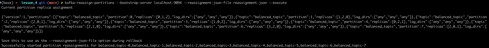
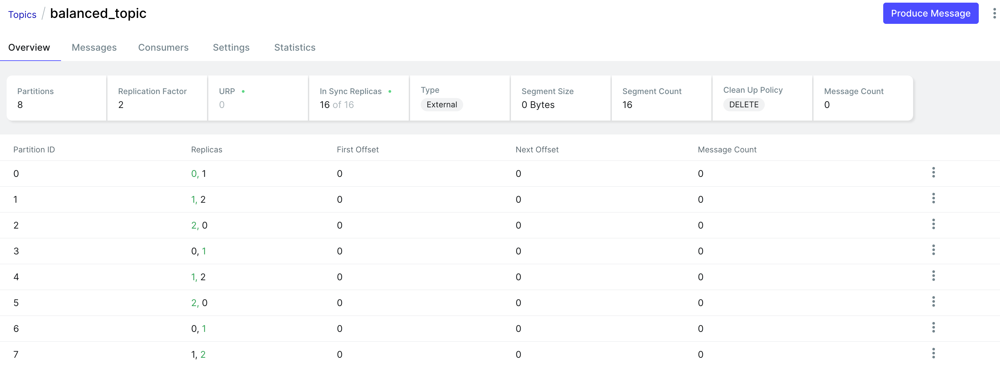
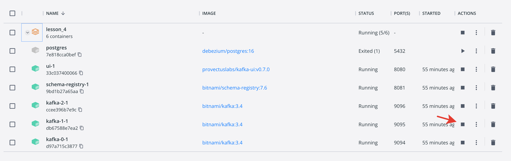
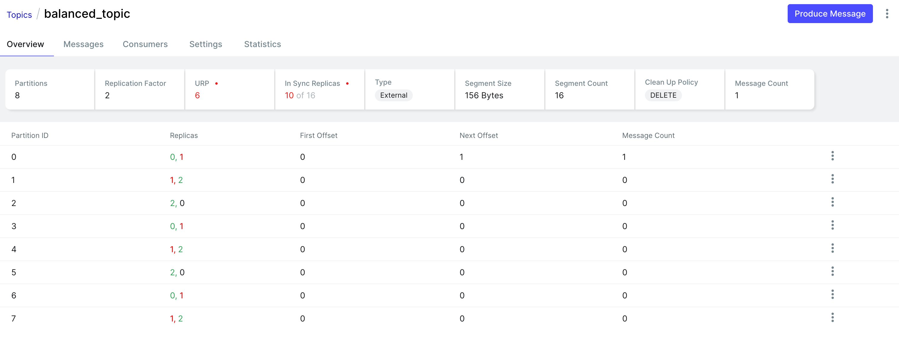
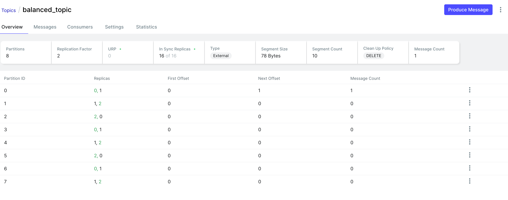

**Задание 1**

Создаем топик balanced_topic с 8 партициями и фактором репликации 3: 
```
kafka-topics --bootstrap-server localhost:9094 --topic balanced_topic --create --partitions 8 --replication-factor 3
```

Для перераспределения используем reassignment.json 
```
{
    "version": 1,
    "partitions": [
      {"topic": "balanced_topic", "partition": 0, "replicas": [0, 1], "log_dirs": ["any", "any"]},
      {"topic": "balanced_topic", "partition": 1, "replicas": [1, 2], "log_dirs": ["any", "any"]},
      {"topic": "balanced_topic", "partition": 2, "replicas": [2, 3], "log_dirs": ["any", "any"]},
      {"topic": "balanced_topic", "partition": 3, "replicas": [3, 0], "log_dirs": ["any", "any"]},
      {"topic": "balanced_topic", "partition": 4, "replicas": [0, 2], "log_dirs": ["any", "any"]},
      {"topic": "balanced_topic", "partition": 5, "replicas": [1, 3], "log_dirs": ["any", "any"]},
      {"topic": "balanced_topic", "partition": 6, "replicas": [2, 0], "log_dirs": ["any", "any"]},
      {"topic": "balanced_topic", "partition": 7, "replicas": [3, 1], "log_dirs": ["any", "any"]}
    ]
  }
```
Вот такой командой 
```
kafka-reassign-partitions \
--bootstrap-server localhost:9094 \
--broker-list "0,1,2" \
--topics-to-move-json-file "reassignment.json" \
--generate
```

И вот так применяем 
```
kafka-reassign-partitions --bootstrap-server localhost:9094 --reassignment-json-file reassignment.json --execute
```

Вот такой результат выдастся:




Останавливаем kafka-1

 


Вернули обратно и стало хорошо: 


**Задание 2**
Запускаем кластер
```
cd certs
docker-compose up
cd ..
```

Настраиваем топики 
```
chmod +x topic_and_acl.sh
./topic_and_acl.sh 
```

Запускаем приложение 
```
3. Собираем докер образ приложения ```docker build -t lesson4-app .```
4. Запускаем приложение ```docker run --network host lesson4-app```
```